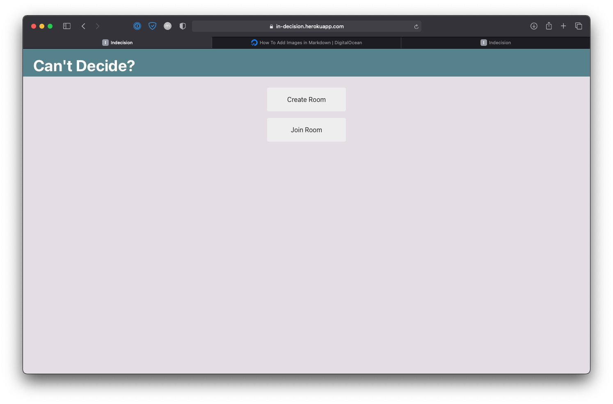
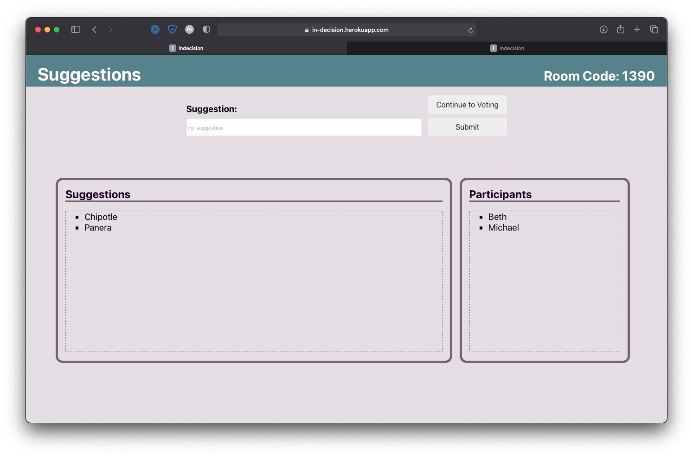
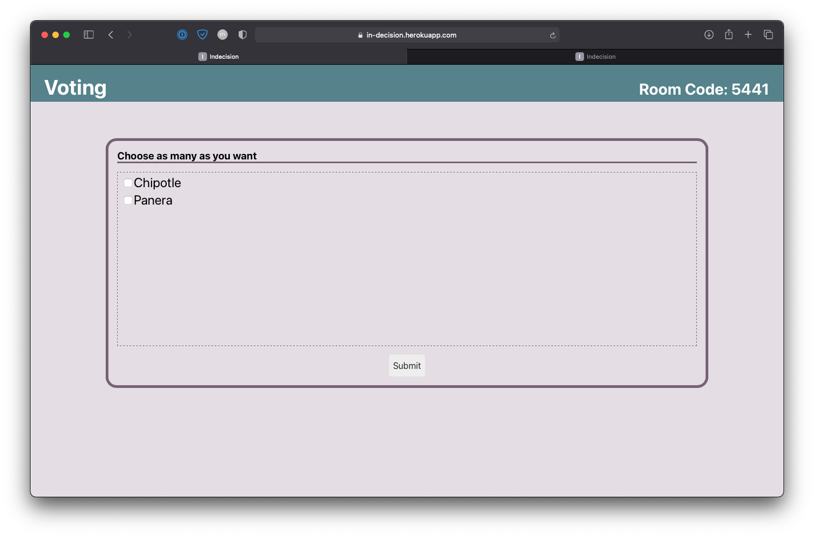
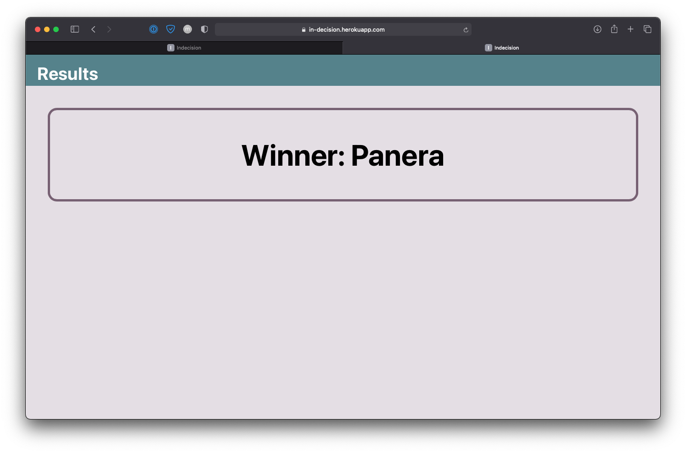

# Indecision App

This app helps groups of people make decisions. People can join private rooms, make anonymous suggestions, and then vote on a suggestions. This can help people decide what to eat/what game to play/what movie to watch etc. 

Deployed App: https://in-decision.herokuapp.com

To run app locally:
1. change wssURI in `client/src/Home.js` to the localhost
2. open two terminals
3. run `npm install && npm start` in one terminal
4. run `cd client && npm install && npm start` in the other terminal

## Home

## Suggestions

## Voting
Users can vote for as many items as they would like. The winner is determined by the suggestion with the most votes. 

## Results
